# Matrix 1000 – 19" enclosure (1U), 3D views

Enclosure for the new Matrix 1000 control unit, version **v2.19-b3f** (2026-10-08): 1U, 300 mm deep, base tray and lid from 1.5 mm steel sheet, 3 mm aluminium front panel.

## Interactive viewer

**[Open the 3D viewer in your browser](https://dslmande.github.io/m1000-case-3d/)** — drag to rotate, wheel to zoom, right click or shift to pan. Parts can be switched on and off, the enclosure can be made transparent, and a horizontal section can be moved through the unit. Click a part to see its name. The file [`index.html`](index.html) is self-contained and only loads three.js from a CDN.

## Views

| | |
|---|---|
| 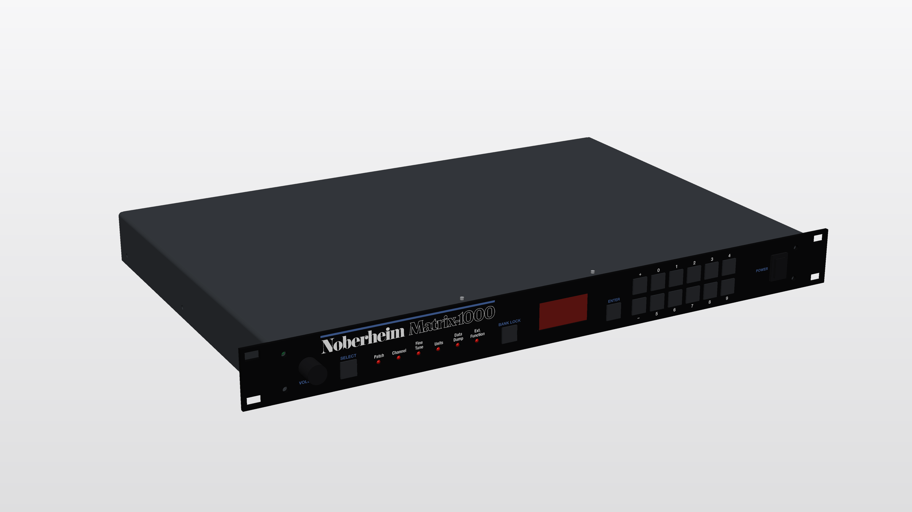 | 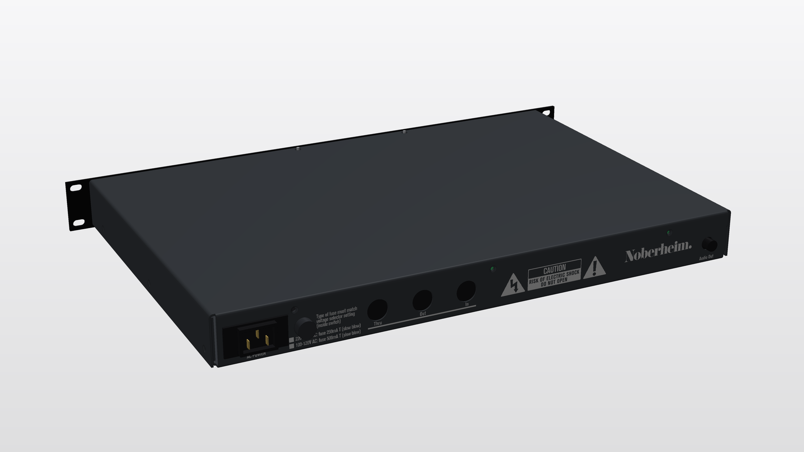 |
| Outside, front oblique | Outside, rear oblique (IEC inlet, fuse, MIDI, audio) |
| 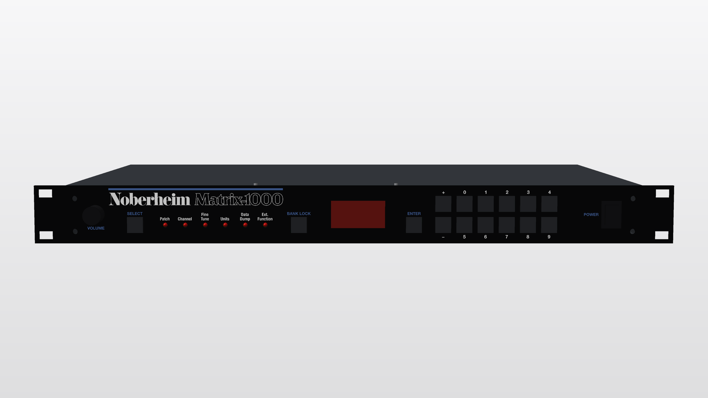 | 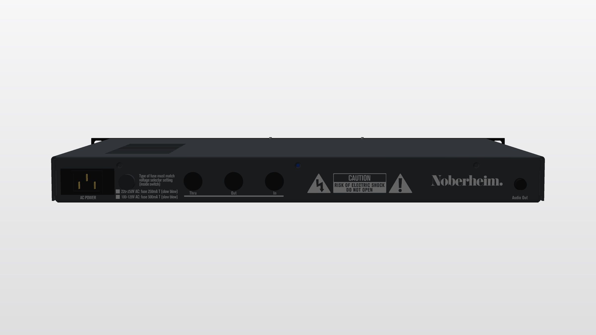 |
| Front | Rear |
| 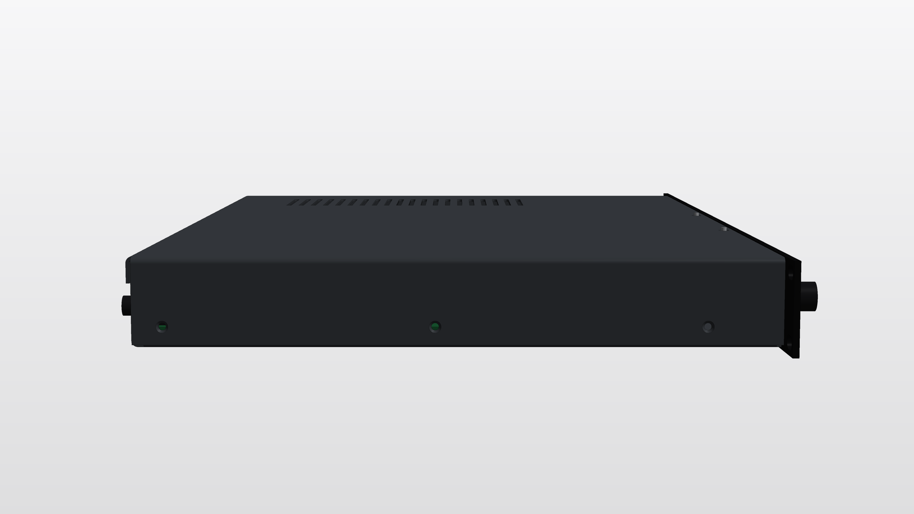 |  |
| Left side | Top (ventilation slots above the heat sink) |
|  | 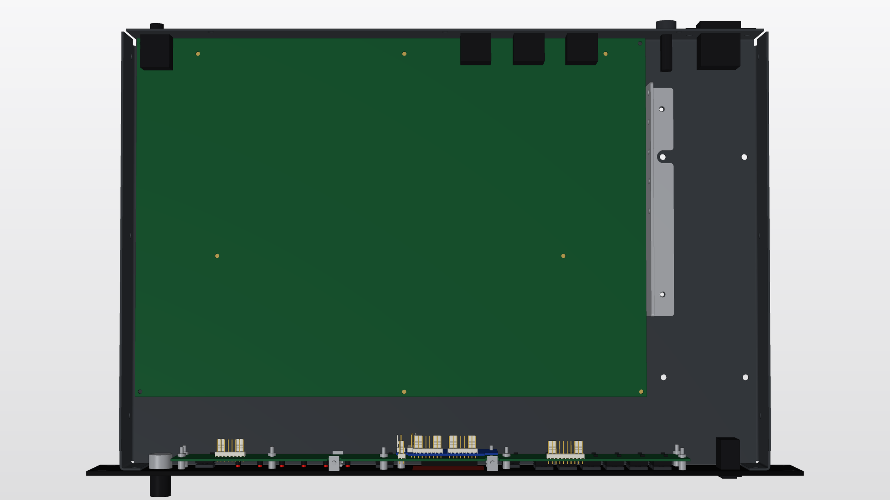 |
| Bottom | Inside from above, lid removed |
| 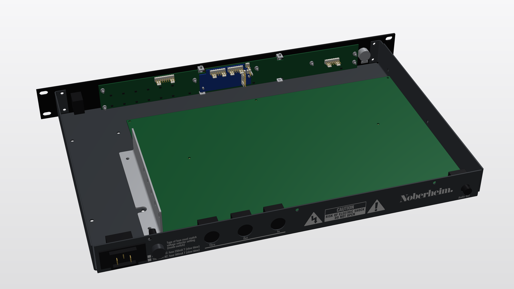 | 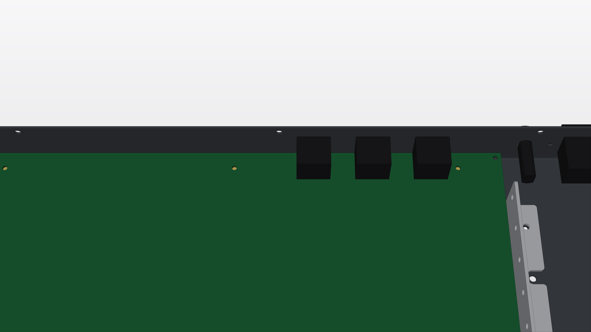 |
| Inside from rear, above | Inside at the rear wall: MIDI, audio, IEC |
|  | 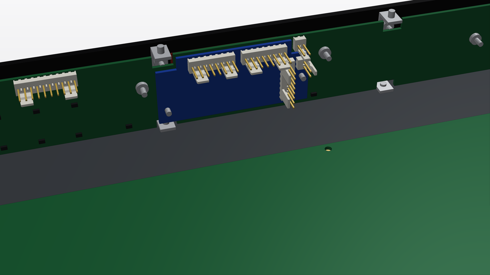 |
| Mainboard from above | Detail: mainboard and display PCB |
| 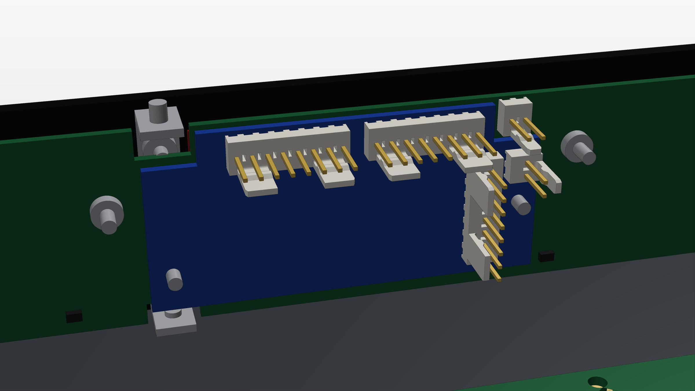 | 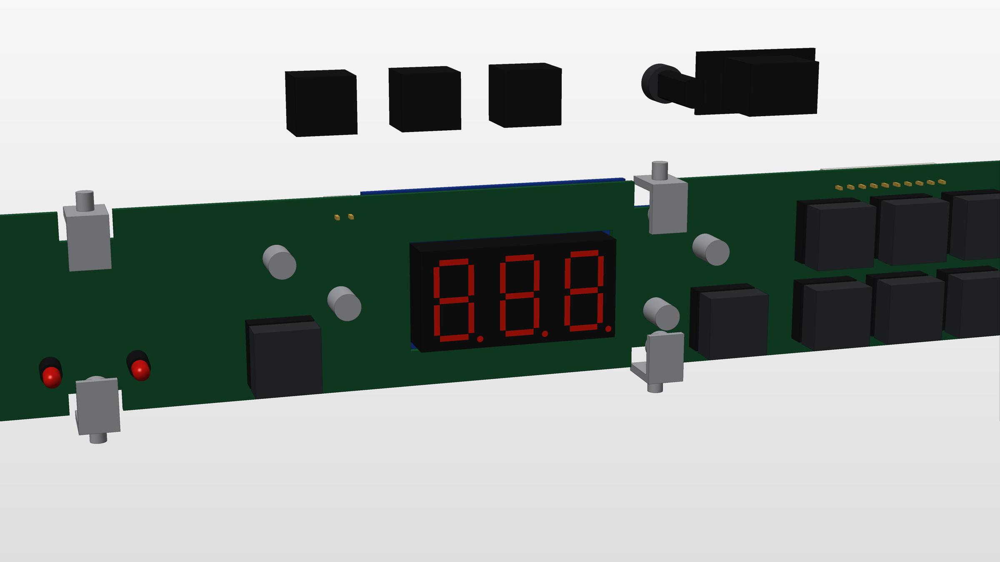 |
| Display PCB from the rear | Control unit from the front, front panel removed |
| 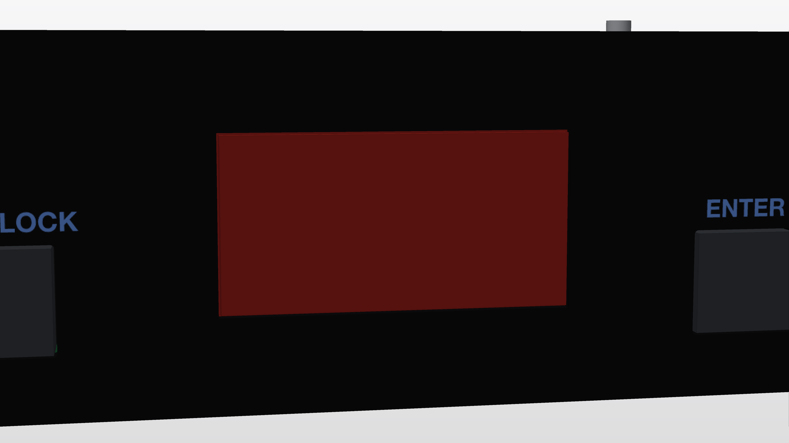 | 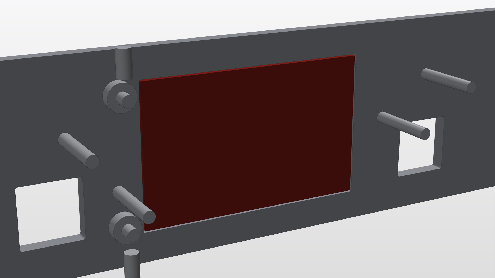 |
| Acrylic display window, front (flush) | Acrylic window in its rear pocket (panel shown light) |

## Finish

- Enclosure (base tray and lid): 1.5 mm DC01 steel (uncoated, not galvanised), **powder coated**. The lid lips are made 0.2 mm larger so that the gap to the tray is still 0.25 mm per side after coating.
- Colours: powder coat RAL 9005 jet black (tray, lid and panel, one batch); screen print white RAL 9010 and blue close to RAL 5023 (sample print before the series).
- Internal heat sink (angle bracket, carried over from the original design): aluminium sheet 2.0 mm, uncoated.
- Display window: stepped red cast acrylic (3 mm), plug 40.4 x 20.4 mm flush with the front, rim 48.9 x 30.4 mm (1.5 mm thick) glued in a rear pocket with a 3.5 to 5 mm bonding ledge all round, so adhesive stays out of the visible area.
- Front panel of the customer version: 3 mm aluminium, **powder coated**, legend **screen printed** (white and blue). All openings are cut 0.2 mm larger to allow for the coating, e.g. the 15 key cut-outs are 12.7 mm square (12.5 mm after coating) with R0.5 corners for the key caps.
- Front panel fixing: 4 countersunk M4 screws into the side tabs of the tray; the control PCB and the brackets sit on 13 M2.5 press-in studs on the back of the panel (9 x 18 mm with 6 mm spacer sleeves, 4 x 10 mm), shown in the viewer with the front panel group.
- Mains switch: Marquardt 1858.1103 rocker, double pole, 10(4) A 250 V~.

## Notes

- The lid has lips on the left, right and rear (screwed from the side); at the front it stays flat and is held by the front panel brackets.
- The rear legend (Thru / Out / In) sits below the MIDI jacks; the lid's rear lip does not cover anything.
- The lid has 20 ventilation slots (3 x 60 mm after coating, pitch 8 mm) directly above the internal heat sink.
- Lid and floor screws are countersunk (ISO 7046 M3, 90 degree countersink dia 5.6), so the heads sit flush.
- The MIDI and audio jacks and the IEC inlet are **simplified bodies** based on datasheets, not manufacturer models.
- The mainboard is a bare PCB without components.
- This is a design-stage model for viewing, not a manufacturing document.
